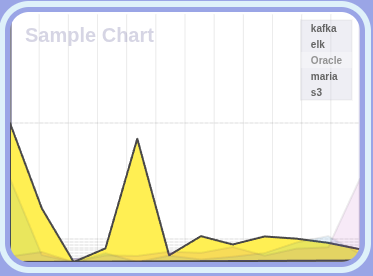
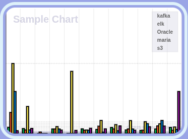
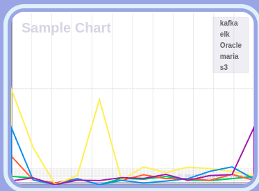
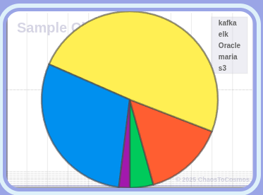
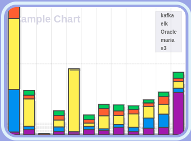

<div align="center">
    
</div>

## 📊 ChaosChart

**ChaosChart** is a lightweight JavaScript charting library designed for simple rendering of various chart types directly into HTML `<canvas>` elements without any third-party frameworks. This library is ideal for embedding clean and minimal charts into websites, dashboards, or internal tools.

---

<div align="center" style="margin: 2em 0;">
    <table>
        <tr>
            <td align="center" style="padding: 12px;">
                <br/>
                <strong>Area Chart</strong>
            </td>
            <td align="center" style="padding: 12px;">
                <br/>
                <strong>Bar Chart</strong>
            </td>
            <td align="center" style="padding: 12px;">
                <br/>
                <strong>Line Chart</strong>
            </td>
            <td align="center" style="padding: 12px;">
                <br/>
                <strong>Pie Chart</strong>
            </td>
            <td align="center" style="padding: 12px;">
                <br/>
                <strong>Ratio Bar Chart</strong>
            </td>
        </tr>
    </table>
</div>

## 🚀 Features

- ✅ Pure JavaScript with no external dependencies
- ✅ Supports multiple chart types:
  - Area Chart
  - Line Chart
  - Circle (Pie/Donut) Chart
  - Bar Chart
  - Ratio Bar Chart
- ✅ Custom titles and flexible configuration
- ✅ Manual DOM integration for maximum control
- ✅ Lightweight and framework-agnostic

---

## ✨ Demo Overview

The library renders five chart types by dynamically creating HTML elements and mounting them into a root DOM node:

```html
<div id="root">
  <!-- Title section -->
  <div class="titleContainer">
    <p>ChaosChart Library v0.0.1</p>
    <p>© All rights reserved by author Kooin Shin.</p>
    <div class="htmlCheck">HTML is loaded and script is running.</div>
  </div>

  <!-- Canvas-rendered charts -->
  <div class="chartContainer"><canvas class="chartCanvas"></canvas></div>
  ...
</div>
````

Each chart is generated using a `DefaultChartFactory` with pre-defined chart constants and sample data.

---

## 📦 Installation

```bash
npm install chaoschart
```

> Or, if you're linking locally:

```bash
npm install file:../path/to/chaoschart
```

---

## 🧩 Usage

```js
import startup from 'chaoschart';

window.onload = () => {
  startup(); // Appends all chart elements to #root
};
```

Make sure you have an HTML element with `id="root"` in your DOM.

---

## 🛠️ Developer Info

* **Author**: Kooin Shin
* **Version**: `v0.0.1`
* **License**: All rights reserved

---

## 📁 Project Structure Summary

```
chaoschart/
├── factory/
│   └── DefaultChartFactory.js
├── ChartConstants.js
├── sample.js
├── index.js
└── README.md
```

---

## 📜 License

```
© All rights reserved by Kooin Shin.
Not licensed for public/commercial use without permission.
```

```

---

Let me know if you want a badge section (e.g. `npm version`, `license`, `made with ❤️`) or auto-generated API docs added!
```
